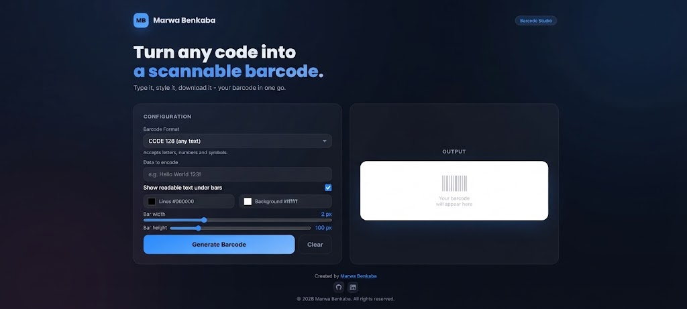
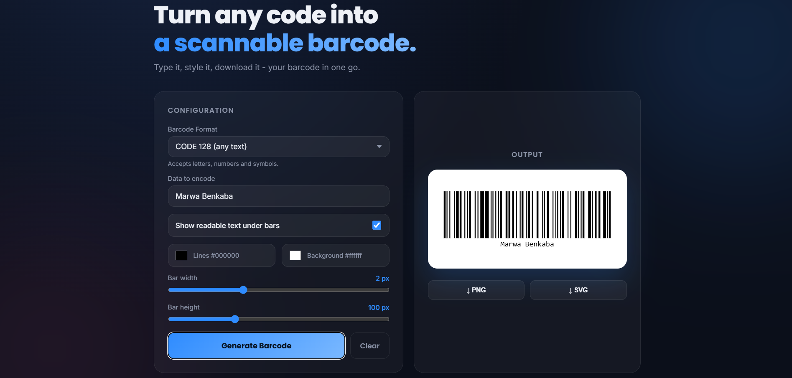

# Devex | Barcode Generator

A clean, single-page barcode generator built with plain HTML, CSS, and JavaScript. Encode text, product codes, and IDs into a styled, downloadable barcode, no build tools, no dependencies to install.


## Features

- **9 barcode formats** - CODE 128, CODE 39, EAN-13, EAN-8, UPC-A, ITF-14, MSI, Pharmacode, Codabar
- **Live format hints** - see exactly what each format expects before you type
- **Custom styling** - pick your own line/background colors, bar width, and bar height
- **Toggleable readable text** under the bars
- **Export options** - download as PNG or SVG
- **One-click Clear** - reset the whole form instantly
- **Responsive, dark glassmorphic UI** - works on desktop and mobile
- **Zero build step** - a single `index.html` file, ready to open or deploy anywhere

## Getting Started

No installation needed.

1. Clone the repo:
   ```bash
   git clone https://github.com/BenkabaMarwa/barcode-generator.git
   ```
2. Open `index.html` in your browser.

## Tech Stack

- HTML5 / CSS3 (no framework)
- Vanilla JavaScript
- [JsBarcode](https://github.com/lindell/JsBarcode) for barcode generation
- Google Fonts (Poppins, Inter)

## Usage

1. Choose a **Barcode Format** from the dropdown.
2. Enter the **data to encode**: follow the hint shown under the dropdown for valid input (e.g. EAN-13 needs 12–13 digits).
3. Adjust colors, bar width, and bar height as needed.
4. Click **Generate Barcode**.
5. Download your barcode as **PNG** or **SVG**, or hit **Clear** to start over.

### Format quick reference

| Format | Example | Notes |
|---|---|---|
| CODE 128 | `Hello World 123!` | Letters, numbers, symbols |
| CODE 39 | `HELLO-123` | Uppercase only |
| EAN-13 | `5901234123457` | 12–13 digits |
| EAN-8 | `96385074` | 7–8 digits |
| UPC-A | `036000291452` | 11–12 digits |
| ITF-14 | `00012345678905` | 13–14 digits |
| MSI | `1234567` | Digits only |
| Pharmacode | `12345` | Number between 3 and 131070 |
| Codabar | `A123456A` | Starts/ends with A–D |

## Roadmap / Ideas

- [ ] Batch generation from a CSV list
- [ ] Saved presets for colors/sizes
- [ ] QR code mode alongside 1D barcodes

Contributions and suggestions are welcome, feel free to open an issue or a pull request.

## Screenshots




## Author

**Marwa Benkaba**
- GitHub: [@BenkabaMarwa](https://github.com/BenkabaMarwa)
- LinkedIn: [marwa-benkaba](https://www.linkedin.com/in/marwa-benkaba-916090329/)

---

© 2026 Marwa Benkaba. All rights reserved.
